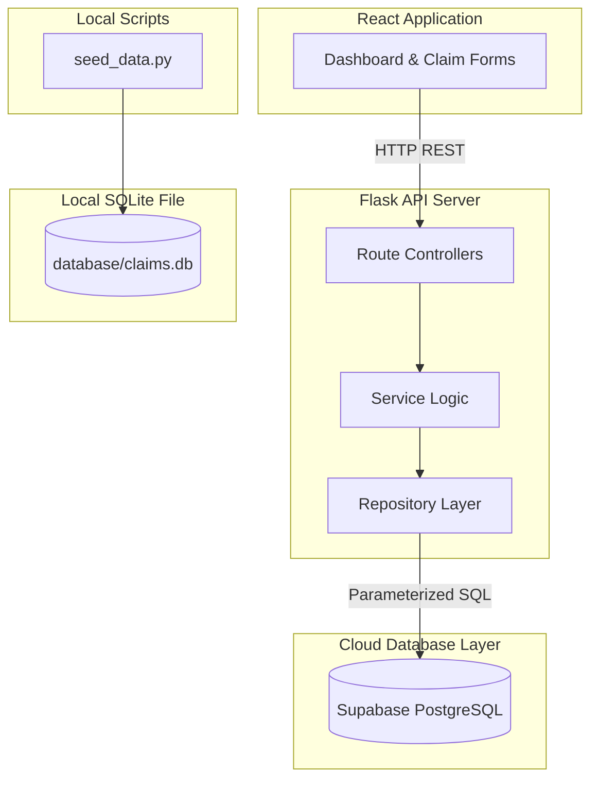
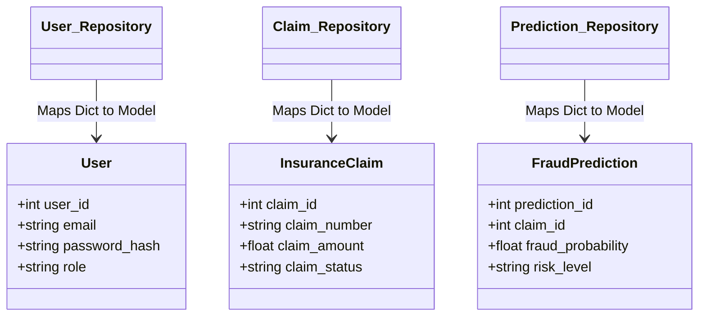

# Database Layer Audit & Production Readiness Report

This document reports on the database architecture, schema constraints, repository mapping layer, service layer integrations, and security aspects of the Healthcare Fraud Detection System.

---

## 1. Current Database Architecture

The application implements a dual-database pattern:
1. **Primary Database (Supabase / PostgreSQL):** Used by the Flask backend repositories for live production user registration, authentication, claim scoring, prediction persistence, and audit logging.
2. **Local Fallback Database (SQLite - `database/claims.db`):** Seeding scripts (`seed_data.py`) write local testing rows here. It is completely disconnected from Flask services.

---

## 2. Supabase Connection Setup

* **Initialization File:** [backend/utils/supabase_client.py](file:///d:/ML%20bootcamp%20project/bootcamp-ace-26-team-5/healthcare-fraud-detection/backend/utils/supabase_client.py)
* **Active Clients:** Exactly **one** global instance initialized on startup.
* **Credentials:** Configured in `backend/.env`. Exposes `SUPABASE_KEY` (Service Role Secret) and `SUPABASE_ANON_KEY` (Publishable Key). 
* **Connection Security:** Uses the Service Role Key for database access, which bypasses Row Level Security (RLS). This is normal for backend query execution, but exposes all tables if the environment file is leaked.

---

## 3. Database Schema

Tables deployed on Supabase (derived from [schema_postgres.sql](file:///d:/ML%20bootcamp%20project/bootcamp-ace-26-team-5/healthcare-fraud-detection/database/schema_postgres.sql)):

1. **`users`:** Accounts, emails, passwords (bcrypt hashes), and role definitions (`admin` vs `employee`).
2. **`policyholders`:** Insurance customer profiles.
3. **`insurance_policies`:** Policy numbers, premiums, coverages, linked to policyholders (`ON DELETE CASCADE`).
4. **`insurance_claims`:** Claim numbers, amounts, status, and submitter links.
5. **`fraud_predictions`:** Label classifications, continuous probabilities ($0.0 \le P \le 1.0$), and remarks. Cascades on claim deletions.
6. **`audit_logs`:** Logging for security and claims event changes.

---

## 4. Repository & Service Mappings

* **SQL Injection Safety:** High. Repositories utilize PostgREST query builders (e.g. `.select().eq()`), which compile into parameterized REST calls, natively eliminating SQL injection vectors.
* **Bypasses:** [backend/services/audit_service.py](file:///d:/ML%20bootcamp%20project/bootcamp-ace-26-team-5/healthcare-fraud-detection/backend/services/audit_service.py) writes directly to Supabase via `supabase.table("audit_logs").insert()` rather than calling a repository mapper.
* **Duplicate Repositories:** Code duplication exists between `backend/repositories/claim_repository.py` (Supabase PostgreSQL client) and `database/claim_repository.py` (local SQLite queries).

---

## 5. CRUD Matrix

| Table | Create (C) | Read (R) | Update (U) | Delete (D) |
| --- | :---: | :---: | :---: | :---: |
| **`users`** | `create_user` | `find_user_by_id` `find_user_by_email` | ❌ None | ❌ None |
| **`policyholders`** | `save_policyholder` | `find_policyholder_by_id` `find_policyholder_by_name` | `save_policyholder` | ❌ None |
| **`insurance_policies`** | `save_policy` | `find_policy_by_id` `find_policy_by_policyholder_id` | `save_policy` | ❌ None |
| **`insurance_claims`** | `save_claim` | `find_claim_by_id` `find_claim_by_number` `get_paginated_claims` | `save_claim` | `delete_claim` |
| **`fraud_predictions`** | `save_prediction` | `find_prediction_by_claim_id` `find_high_risk_predictions_with_claims` | `save_prediction` | ❌ None (handled by DB cascade) |
| **`audit_logs`** | Direct DB Insert | `get_paginated_audit_logs` | ❌ None | ❌ None |
| **`notifications`** | ❌ In-memory list | ❌ In-memory list | ❌ None | ❌ None |

---

## 6. Critical Gaps & Mismatches

1. **Frontend-Backend Endpoint Mismatches (404 Failures):**
   * The frontend API client (`frontend/src/api/`) queries `/login`, `/dashboard`, `/claims`, and `/predict`.
   * The backend Flask app registers routes under `/api/auth/login`, `/api/dashboard`, and `/api/claims`.
   * The frontend calls `/predict` instead of `/api/claims`.
   * **Verdict:** Frontend cannot connect to the backend immediately.
2. **Mock Data usage in Frontend UI:**
   * The React dashboard pages (`Dashboard.jsx`, `ClaimHistory.jsx`, `SubmitClaim.jsx`) use fully static mock claim objects and mock cards inside their JSX templates, ignoring the API wrappers.
3. **Disconected Notifications:**
   * No notification routes, controllers, or database tables exist. The `notification_service.py` functions use in-memory stubs and are never invoked in claim or prediction service workflows.

---

## 7. Performance & Security Analysis

* **Performance:** High. The dashboard aggregates predictions and claims in a single roundtrip via a nested join query (`prediction:fraud_predictions(*)`), avoiding N+1 performance bottlenecks.
* **Security & RLS:** No Row-Level Security (RLS) policies are defined in [schema_postgres.sql](file:///d:/ML%20bootcamp%20project/bootcamp-ace-26-team-5/healthcare-fraud-detection/database/schema_postgres.sql). Exposing anon or service role keys could allow unauthenticated users to modify or delete rows.
* **Offline Fallbacks:** If the cloud Supabase instance is unreachable, any API endpoint querying the database throws network connectivity exceptions. No local SQLite fallback is enabled in backend routes.

---

## 8. Integration Status

| Component | Status | Description / Reason |
| --- | :---: | --- |
| **Authentication** | 🟡 Partial | JWT validation works on backend; login endpoints exist; frontend form templates remain static mocks. |
| **Database** | 🟡 Partial | Repositories fully map to Supabase; database requires external cloud network connectivity. |
| **Claims** | 🟡 Partial | Service runs predictions and updates database; frontend claim forms remain static mocks. |
| **Prediction** | ✅ Connected | Prediction service saves scores to Supabase and logs to `prediction.log`. |
| **ML** | ✅ Connected | Executes Keras v1 Sequential predictions on PyTorch backend. |
| **Dashboard** | 🟡 Partial | Backend compiles summary endpoints; frontend rendering is static mock data. |
| **Reports** | 🟡 Partial | Backend reports compile claim status totals; frontend has no report pages. |
| **Notifications** | ❌ Not Connected | No database table, no route, and service is never invoked. |
| **Audit Logs** | ✅ Connected | Records logs to `audit_logs` table and `prediction.log`. |
| **Manager & Inspector**| 🟡 Partial | Route constraints restrict status edits; frontend has no interactive workflow. |

---

## 9. Production Readiness Score

**Score: 65%**

* **Strengths:** Parameters validation is clean, backend JWT checks are robust, ML model is fully integrated, database queries are optimal.
* **Weaknesses:** Frontend is not connected to API routes due to path mismatches; notifications are a stub; no cloud database RLS security policies; database queries lack offline fallbacks.
